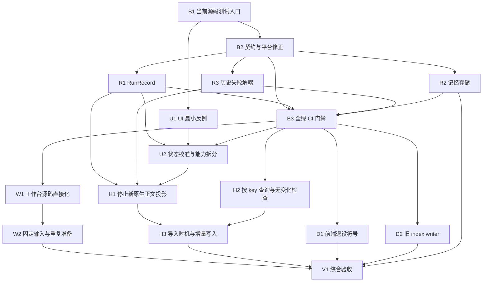

# YUME 审计整改施工方案

日期：2026-09-30（Asia/Shanghai）。依据：[仓库审计](../AUDIT.md)。核对基线：`482b52952ecab5297dda410d5c14ac6c019ab003`，YUME `0.4.16`，OpenCode `1.18.21`。

本方案将 F01 至 F09 拆成可独立实施、验证和回退的工作包。目标是让执行状态与持久数据可信，让工作台能够重复构建，并让迁移兼容退出新任务和普通历史读取的关键路径。保留现有 Tauri、React、OpenCode 和 SQLite 架构。

当前状态为**施工进行中，首批源码修复已落地**。实际改动、命令与未验收范围记录在[施工进度](audit-remediation-progress.md)。下文保留施工要求与原审计参考数据，不能将首批源码回归通过视为 V1 综合验收完成。工作树已有角色资源及 archive 素材删除，不纳入整改，也不恢复或提交。本方案不触发提交、push、版本变更或发布。

## 施工顺序与完成标准

建议调整审计路线图的落地顺序：可信测试入口仍先行；建立可重复的失败基线后，优先修运行状态和记忆库，低风险删除可穿插进行。清理几个无用符号不作为高严重度修复的前置条件。F04 的最小反例也在开工阶段验证，以便尽早确定 UI 修复范围。

| 阶段 | 工作包 | 交付目标 | 退出条件 |
| --- | --- | --- | --- |
| 0 建立可重复基线 | B1、B2、U1 | 当前源码测试清单、可信隔离、失败分类、UI 最小反例 | 每个失败能稳定复现并归类；保留 F02 真正失败，尚不宣称全套通过 |
| 1 修复状态与存储 | R1、R2、R3，随后 B3 | RunRecord 提交一致、记忆初始化可靠、历史写失败不干扰任务 | 故障注入及相关回归通过；当前源码全套与适用平台测试全绿，启用日常门禁 |
| 2 固定构建与 UI 协议 | W1、W2、U2 | 工作台源码表达实际交付行为，固定输入可重复；UI 可恢复校准 | 完整工作台重建及 scoped 行为验收；F04 最小反例通过 |
| 3 收窄迁移与读写 | H1、H2、H3、D1、D2 | 新原生正文不再持续复制，catalog 按 key 读写，退役代码移除 | native/legacy/local-only 兼容、墓碑与组织信息保持；计数证明读写成本下降 |
| 4 综合验收 | V1 | 两平台适用测试、隔离宿主行为、干净构建与回退证据 | 下文完成清单全部满足；无法执行的项目明确保留为未验收 |

各工作包建议独立 commit 或 PR；同一提交应同时包含必要的行为改动和对应验证。工作包可以含多个小提交，但提交之间不能要求删除用户数据或重放 prompt 才能恢复。实际提交与发布在后续明确要求时执行。

### 依赖与并行边界



B3 在 B1/B2 与 R1/R2/R3 完成后建立首个全绿基线。若阶段 0 发现审计之外的独立失败，先登记和修复或明确平台适用性，不能通过缩小测试清单使 B3 变绿。

可并行的实现面：R1 的 Agent 生命周期、R2 的 memory 存储、W1/W2 的工作台构建。工作台可提前开发，阶段 2 集成仍等待 B3。R3 与 R1 都涉及 Agent，合入前串行核对 collector、finish 与 supervision；U2 与 D1 都触及 `ChatApp.tsx`，避免同时编辑。H1 与 H3 共用 history 调用链，按依赖串行。每条线复用 B1 的验证入口。

## 目标边界与保留契约

OpenCode 继续拥有原生 session、message、part 和工具事实；Rust 继续拥有运行归属、批准、终态与恢复；catalog 保存产品组织信息；memory 和 worklog 保持独立事务、来源、忘记屏障与幂等回执。

施工必须保持以下契约：

- 使用 sidecar、directory、session 的完整复合身份；保留 generation guard、permission provenance 和 workbench 租约。
- 停止经过宿主及原生状态确认；权限和停止能力不由发送按钮状态推导。
- 旧文本仍可读，已删除内容不复活，linked local-only 回复不伪装为原生消息。保留 backend 公开 IPC，删除内部 wrapper 不构成删除命令的理由。
- 保留自动记忆和工作日志的独立分支提交、设置代次、来源排除、手工报告修订及恢复语义。
- 保留角色包与渲染器兼容、keyring、typed 附件边界及发布签名边界。

本轮不升级 OpenCode、不改原生数据库、不新建全局状态 manager、不统一两库、不替换框架或 renderer。新增持久化字段或 schema 只有在现有格式无法承载必要语义时才另行设计；默认工作包保持格式兼容。

## 基线与日常门禁

### B1 限定测试发现并验证隔离

对应 F07。主要落点：`package.json`、`bunfig.toml`、`src/testing/`，以及一个计划新增的测试运行脚本。

1. 显式枚举当前 `src/`、`scripts/` 和根目录现有 Vite 配置测试，以完整规范路径排序，拒绝发现空集合。排除 `output/`、上游 clone、构建目录和依赖目录；不依靠 substring filter 或 Git ignore 控制测试发现。
2. 以审计已验证的**逐文件独立进程**作为初始正确性方案。每个子进程接收一个绝对文件路径，保留 DOM preload；完整汇总通过、失败、skip、启动异常、超时和退出码，失败不能被成功子进程覆盖。
3. 组合运行或 Bun `--isolate` 仅作为后续性能优化候选。先对 `mock.module`、Tauri mock、DOM 与 cleanup 做等价验证，再替换独立进程方案。
4. 使用可配置且有上限的子进程执行预算。超时或中断清理本次子进程，标记未完成文件，不输出误导的全套成功。

验收：干净 checkout 与包含旧 `output/` 副本的维护者 checkout 得到完全相同的测试清单；单文件与全清单独立进程结果一致；刻意让一个 fixture 失败或无法启动时，总入口返回非零。测试数量随源码变动重算，不将审计时的 153 个文件写成永久白名单。

### B2 修正漂移契约并明确平台适用性

对应 F07。主要落点：`AiProviderList.test.tsx`、`WorklogReceipt.test.tsx`、Rust worklog tool tests、Windows path fixtures、README 与原生迁移决策文档。

| 审计观察 | 施工动作 | 必须保留的证明 |
| --- | --- | --- |
| AiProviderList 对象新增 `manualModelIds: ""` 导致旧断言失败 | 根据当前 provider 保存契约更新期望 | provider 切换、字段保存和自定义模型语义 |
| 前端与 Rust worklog 断言要求已移除按钮的文案 | 改成当前自动归档及显式工具授权契约 | 回执显示、来源幂等、普通提及不等于创建调度 |
| Mac 上 6 项 Windows path fixtures 失败 | 区分平台专属 filesystem 行为与跨平台逻辑；前者条件编译并在 Windows 执行，后者用临时本机目录覆盖 | 完整目录身份、路径规范化、目录冲突和 provenance，不能只给全部失败加 skip |
| README 与 D1-12 描述落后 | 更新现行自动记忆、工作台准备和 bridge 契约；历史决策补 superseded 说明 | 旧决策与验收证据保留，当前说明能按源码执行 |
| 并发首次 memory open 在 WAL 配置处锁失败 | 保持失败样本，交由 R2 修复 | 属于产品存储缺陷，不能作为 fixture 噪声删除 |

验收：前端两个独立失败与 Rust 文案失败被有意义的契约替代并通过；Mac/Windows 各执行适用 path 测试。每个 skip/ignored 均列出原有原因和适用平台，新增数不能静默增加。

### B3 建立全绿 push 和 PR 门禁

对应 F07。计划新增一个普通 push/PR workflow，并让发布流程复用同一组校验入口，保留原有签名与发布专项检查。

首批施工已新增 `test:frontend`、`test:rust`、`check` 命令，本地与 CI 共用这些入口。源码验证与 workflow 实际执行状态分别记录在施工进度中。

门禁包含生产与测试 typecheck、B1 全清单测试、适用平台 Rust library suite、前端 build。macOS 和 Windows 分别执行平台相关测试；完整工作台 build 可安排为独立 job，不能用已有 `public/workbench/` 冒充重建成功。B3 初始复用 release workflow 已固定的上游 ref 与当前准备流程；W2 完成后接入统一指纹和重复准备的检查，不能将 W2 尚未交付的能力称为 B3 已验证。计划保留已有 ignored 项的说明，不将本次已知失败加入忽略集合。仓库目前没有 lint gate，不在验收报告中写“lint 通过”。

验收：R2 修复后，当前源码回归全绿；用受控回归证明 PR job 会失败；分支保护 required checks 的启用状态单独记录，workflow 文件成功合入不等于分支保护已生效。B3 不承担 Apple 公证或 updater 签名。

## 运行状态与记忆存储

### R1 统一 RunRecord 持久化提交顺序

对应 F09。主要落点：`agent/lifecycle.rs`、`lifecycle_finish.rs`、`record_store.rs` 及现有 lifecycle tests。

将 `bind_session`、`update_active` 和 `finish` 对齐到 `begin` 的顺序：在现有锁内构造 next record，成功持久化后再替换 active。失败时保留最后成功提交的 record，不能将已修改的候选放回 active；finish 中的输入清理与终态也服从同一规则。

保留 operation lock、session 登记、submission 状态与恢复约束。外部登记或已经发生的原生调用可能成功而本地写盘失败，不以重发 prompt 或增加跨系统事务处理。

本次核对发现需要同时处理的错误路径：prompt 已成功而 `confirm_submission` 写盘失败时，`initial_input` 仍在，collector 会跳过；重启恢复当前也只 block session，不能假定已有自动补偿。在现有 caller/恢复边界补充最小恢复流程：只重试确认持久化，或依据 scoped 原生事实安全 settle；是否已提交不明时继续保留屏障并核对事实。禁止重新调用 `agent_run_start` 或重发 prompt。存储恢复后不能永久停在 preparation，权限归属也要与确认后的状态一致。

验收：成功 begin 后注入 store 写失败，分别覆盖 bind、confirm_submission、request_finish、reconcile、finish；检查 RAM 读取、磁盘重读和模拟重启都等于最后成功状态。特别覆盖权限登记成功、bind 持久化失败时 caller 的清理，以及合成 HTTP 中 prompt 已接受但 confirm 写盘失败的恢复。恢复可写后仅重试对应元数据提交或可信 settle，prompt 计数保持一次；完成事件只在成功提交后发布，失败不得提前清除 active。故障注入用合成 store 或可控失败点，不能靠真实用户目录的权限操作。

### R2 收窄记忆库初始化和升级协议

对应 F02。主要落点：`memory/storage.rs`、现有 SQL migrations 与存储测试。

建议按两个提交实施：先修 WAL 初始化竞争及未来版本拒绝，再收敛迁移事务与移除主文件回拷。两个提交仍共同构成 R2 验收。

1. 对首次 WAL 转换做有界 BUSY/LOCKED 处理，明确总等待预算、重试范围和失败返回；保留连接 busy timeout，不将所有数据库错误统一重试。
2. 在迁移写锁内重新读取 schema version。等于当前版本直接成功；高于当前版本明确拒绝且不更改数据库。未来版检查尽量在可避免的持久化配置变更之前完成。
3. 全部待应用迁移和 `user_version` 前移放在一个 IMMEDIATE transaction 内；失败由 SQLite 回滚，保留当前 schema 和已有内容。
4. 删除打开中 WAL 主文件 `fs::copy` 备份及回拷 fallback。施工先核对是否存在升级备份契约；若确需保留备份，使用 SQLite 一致快照或关闭所有相关连接后的明确协议，作为独立保障设计，不能把它当作事务回滚。
5. 改写未真正进入 `current > 0` 分支的恢复测试，用有效旧版 schema 和可控迁移失败替代。

验收矩阵：schema 0/1/2/当前版/未来版；多步迁移中途失败；未 checkpoint 的已提交 WAL 数据；两个真实独立进程同时首次打开；重开后的 `integrity_check`。失败迁移中已提交旧内容不丢、schema/version 不前移；等待有界；未来版保持可读副本与明确错误。继续覆盖忘记屏障、跨进程写入和 memory/worklog 分支恢复。

### R3 将历史投影故障从原生任务控制路径移出

对应 F01 的第一步。主要落点：`agent/collector.rs`、`supervision.rs`、`run_commands.rs`、`scheduled.rs`、`history/archive.rs` 与 collector/runner fixture。

先保留现有投影写入，将其错误降为独立可诊断的历史展示错误。一次 archive 写失败不应跳过当前 native snapshot 的 reconcile、权限同步、终态确认和后续轮询；移除**仅因投影失败**触发的 30 秒结束路径。

本次方案核对进一步确认：交互入口 `run_commands.rs` 与定时入口 `scheduled.rs` 的 `save_agent_input` 失败也会在 prompt 前中止任务。R3 建议分两步提交：先解除 collector 门控，再解除这两条启动路径中的**旧正文写入**门控；相应 fixture 同步覆盖。用量采集应脱离 archive 的错误传播链，避免历史展示故障顺带跳过用量记录。

`supervision::submission_failed` 在原生 settle 后也用 `save_agent_snapshot(...)?` 门控终态与权限清理，同样纳入 R3。提交结果不明需要继续原生确认；已经 settle 后的投影失败不能阻止 RunRecord 终态提交和权限归属释放。

不要同时放宽原生 API 故障、RunStore 故障、sidecar 无响应或取消超时的处理。RunRecord 的目录/session/run、submission 的 `initial_input` 屏障、message/part/call IDs、pending 与最终 outcome 仍须持久化；权限 provenance、resource scopes 和恢复元数据继续受原规则约束。`run_commands` 目前还将 catalog 模型选择写失败复用为 `history_storage_failed`，必须区分必需产品元数据与旧正文错误，不能按这个字符串一律吞错。错误使用已有日志或产品错误渠道并有界去重，避免每秒刷日志或新增常驻提示。

验收：旧历史输入及快照一直不可写时，interactive/scheduled 两类任务仍能提交，原生任务仍显示待批准、批准/拒绝结果正确、owned IDs 正常登记、自然完成正常、取消经过确认；跨过旧 30 秒宽限也不因投影原因结束。增加“prompt 接受结果不明、原生 settle 已确认、archive 失败”的样本，确认不遗留 pending active 或权限归属。对照注入 native/RunStore/模型选择持久化故障，原有约束仍生效。审计及本次规划只确认调用链，施工必须补足这些行为证据。

## UI 状态与工作台构建

### U1 先建立 UI 最小反例

对应 F04，并验证审计的多 text parts 观察。复用已有 scoped API mock、组件测试与宿主 fixture，不先拆分 ChatApp 或添加全局 manager。

建立三个必测场景：断线期间原生完成后 SSE 重连；自己正在执行的会话收到 catalog busy 更新；页面首读为空闲之后 scheduled run 启动。每例分别检查正文、运行状态、Stop、批准和完成回调。

再加一个 message 含两个 text parts 的合成样本，比较 live 展示与重新打开历史，确认当前 `messageId`/`partId` 更新是否丢段或重复。此观察尚未成为已复现缺陷；按反例结果决定是否需要最小修复，不能默认升级整个消息模型。

交付物是最小失败或通过证据及预期契约。若某场景无法复现，记录 fixture 覆盖范围和调用链风险，不以静态判断宣称端到端已复现，也不删除该场景的验证要求。

### U2 在事实变化边界校准并拆开发送与停止能力

对应 F04。主要落点：`src/lib/opencode.ts`、`ChatApp.tsx`、`useAgentRun.ts`，必要时增加最小宿主事件通知。

- SSE 确认重新建立连接时，使用现有 scoped snapshot/status API 补读消息与状态。首次连接也需要避免订阅与快照之间的漏事件；保留稳定 ID 和 generation 检查，合并快照与随后事件，不重发 prompt。
- `useAgentRun` 持续获知宿主 run 的变化，包括 idle 到 scheduled run。优先复用或补充现有事件与快照；如当前宿主缺少可靠通知，可用现有 hook 的有界轮询。不得只在 idle 首读一次，也不创建另一个权威运行状态。
- ownership 移交、窗口恢复、sidecar 恢复等明确边界重新校准。旧目录或旧 session 的异步结果必须丢弃。
- 独立计算 send、approve、cancel。busy 的当前会话可以不能发送下一条，但仍可按可信 owner 停止或批准；catalog `send:false` 不能隐藏合法 Stop。所有取消仍调用宿主确认路径。

验收：U1 三例通过；同裸 ID 不同目录不串用；切换会话时迟到快照不覆盖当前页面；重连或重复 idle 不产生重复完成、重复归档或提取；可见 Stop 与实际取消权限一致。若 U1 证明多 part 缺陷，保持 message/part 身份修复并加入 live/reopen 一致验收。

### W1 把工作台交付行为写回自有源码

对应 F05。主要落点：`scripts/workbench-overlay/workbench/entry.tsx`、overlay Vite config、`workbench-routing.ts`、`prepare-workbench.ts` 及 routing/ownership tests。

先列出当前 transform 实际提供的路由、scoped identity、ownership、abort directory、历史登记行为，将等价逻辑直接放进自有 overlay。通过显式 alias 引用 `src/workbench/session-route.ts` 等共享模块，确保实际入口接受上游上下文的类型检查；不要复制第二套复合 key 编解码。现有两份 `tsconfig` 只 include `src`，`bun run typecheck` 不覆盖 overlay entry，W1 必须补充实际入口的类型验证，Vite 转译构建也不能替代该检查。

再删除 transform 与仅为它生成的 `.omo/workbench-routing.vite.config.mts` 分支。保留仓库拥有的正常 overlay Vite config、Platform bridge、主题资产和 terminal WASM。不要因为去掉 generated config 就移除完整工作台所需配置。

测试应执行实际共享行为或真实入口的可测边界，不再依赖精确字符串改写、按 marker 切片后执行。主要验收仍是完整 bundle 和宿主行为，单纯源码 marker 断言不足以证明交付等价。

验收：重建完整工作台；两个项目含相同 session ID 的切换、scoped handoff、目录受限 abort、历史登记、隐藏再显示和租约释放正常；终端 WASM、鉴权及主题继续工作。保留 OpenCode `1.18.21`。

### W2 校验固定输入并支持重复准备

对应 F06。复用 `prepare:workbench` 作为明确入口，让本地与 CI 使用同一组固定输入校验，不静默下载 latest。

当前 release workflow 固定上游 commit 为 `826d9ad46a22bef0294998e08daa3c4904fea28f`；历史 baseline 记录上游 `bun.lock` SHA-256 为 `334AC7FB44E967944973C979ECAA218ACA96FD19028EAB36A89EA3F2BCBA1029`。施工重新核验后再将它们作为机器可验证的统一指纹，同时核对 app 版本与依赖安装方式。本地 `YUME_OPENCODE_SRC` 和 CI checkout 均必须验证，不能仅检查 package.json 存在。

准备步骤仅管理明确拥有的 overlay 文件与输出。建议在独立 staging 中组装；若继续写 clone，必须记录拥有的文件及上次内容指纹，仅对可证明属于本工具的旧 overlay 更新，冲突时明确失败。不能递归覆盖上游源码或他人编辑。新增机器元数据保持 ignored，不进入发布资产。

构建先生成并核对临时 bundle，再替换 `public/workbench/`；失败不能留下混合的新旧输出，后续 build 不能静默消费陈旧 bundle。dev 可复用**指纹匹配**的完整产物，缺失或失配时按文档显式准备；不要为每次 Vite 热更新完整重建上游。

验收：新 checkout 按文档可构建；错误 ref/lock/version 被拒绝；相同输入重复准备成功；修改自有 overlay 后可再次准备；上游用户改动得到保留或明确冲突；构建失败不被报告成功。资源指纹含自有 overlay 和相关共享模块，不能只校验上游 commit。

## 历史路径与退役代码

### H1 停止为新原生 Agent 会话持续复制正文

对应 F01 的第二步，依赖 R1、R3、U2。主要落点：collector/archive 调用、history commands/recovery、`useAgentHistoryView` 及 ChatApp 的 Agent adopt/open 路径。

先核对 Agent 开始、活动中、终态、重启恢复与 reopen 的全部入口。本次核对确认 ChatApp 的新任务、native reopen 和 returnToAgentTask 已走 catalog key 与 `openScoped`；裸 `openHistory` 用于 legacy 分支，`adopt` 没有生产 caller。因此 UI 以无旧快照的准入验证为主，只修验收证明仍有依赖的入口，保留 legacy 读取，不预设需要全面转换。

随后同时停止新 native run 的 `save_agent_input` 旧正文写入和周期 `save_agent_snapshot` 复制。RunRecord 和 catalog 保留运行/组织元数据及必要 submission 屏障；确认 catalog 能仅凭 RunStore 与 native facts 建立归属、来源、标题，正文经 native API 读取。保留已有旧投影、legacy reader、墓碑、linked local-only 回复和既有 fallback。定义原生暂不可用时的 retryable/unavailable 展示，不能将没有历史投影误判成没有会话，也不能伪造缺失工具内容。

验收：全新 interactive/scheduled native run 在 `history.json` 中没有对应 session，也能新建、隐藏、live/reopen/续聊、Stop、批准和重启恢复；已有 native 与纯旧文本读取正常；两个目录的同 ID 不串用；删除后不会因发现或旧导入复活；本地确定性回复保持 local-only。同步核对自动记忆和工作日志只从可信来源处理一次。

### H2 实现 catalog 按 key 查询并跳过无变化写入

对应 F03 的第一步，可在 B3 后独立进行。主要落点：`history/catalog.rs` 及 catalog tests。

`get(key)` 改为带 key 条件的查询，同时保留 identity 校验和存储 key 与 metadata 一致性检查。先在现有 update 内比较规范化后的前后结果，无变化不执行整表 DELETE/INSERT；无需新增 schema 或缓存。

验收：合成 1,000 条 catalog，直接 get 只执行按 key 查询；无变化编辑没有 entries 行写入；重复 key、损坏 identity 和 metadata 仍拒绝。模型选择、工作目录记录、组织信息与 tombstone 不变。此步骤尚未完全消除旧 update 的全量读取，不宣称 F03 全部解决。

### H3 将导入移出普通读取并只更新变化行

对应 F03 的第二步，依赖 H1/H2。主要落点：`history/commands.rs`、`catalog_import.rs`、`reconcile.rs`、catalog mutation callers。

1. 将旧 history/index 的初始导入与正常读取分开。仅启动初始化或明确来源变化时导入；初始化失败不能被标记成功，也不能用不可恢复的 RAM 布尔值隐藏重试。
2. 新 native 会话、run 变化、本地回复和删除等通过现有业务边界更新对应元数据。合并过程中保留用户标题、pin/archive/model selection 和墓碑，旧来源不能覆盖用户编辑或 resurrect 删除。
3. 将点操作改为事务内目标 row 更新；需要全目录 discovery 的操作只写变化 rows。避免引入通用 repository/event 框架，也不为降低计数添加未证明必要的缓存。
4. 一次内容读取按 scoped key 取事实与 run 关联，避免多次 `all_records()` 重扫；启动恢复所需的全量 RunStore 扫描保留在恢复边界。先统计实际调用，再决定复用现有状态还是收窄 lookup。

验收：预热后重复打开单条历史不触发 legacy/index 全量导入或 RunStore 全量文件扫描；无变化 native refresh 无 entries 写入，有变化只影响目标 rows。仍允许首次初始化、显式目录 refresh 和目标状态校准发生必要读写。记录 SQL 语句/影响行数/扫描次数的前后对比；千条样本的耗时仅作辅助，不设未经测量的延迟承诺。分页、失败发现、迁移幂等、墓碑、local-only、模型选择及用户组织信息全部通过。

### D1 删除无生产职责的前端符号

对应 F08。删 `ChatApp.tsx` 的 `nativePersistedRef`、`createdRef` 及纯赋值，删 `src/lib/history.ts` 的 `HistorySummary`、`historyList`、`historySave`、`historyDelete`。实施时再次检查生产、测试与动态入口引用。

验收只复用 typecheck 和聊天 reset/resume/local reply、统一/旧历史现有回归；无需为“符号已删除”增加源码文本测试。保留 `historyLoad`、相关使用中的类型、Rust 公开 IPC 与注册。

### D2 用旧格式 fixture 替换测试 writer

对应 F08。将 `native_index.rs` 的模块测试和 migration rollback tests 改用固定旧格式 JSON fixture，然后删除仅测试调用的 upsert/persist/replace writer。

验收：旧 index reader、重复导入、损坏输入、跨目录身份、墓碑和独立回退演练继续覆盖。fixture 直接代表已发布格式，不通过当前 writer 生成，防止 reader/writer 同错通过。保留 reader/types，不改变已安装文件。

## 验证命令与证据规则

以下命令保留规划时的验证入口，实际已执行结果见施工进度；原审计参考数据不替代本轮验收。在仓库根目录运行；macOS 指定 `DEVELOPER_DIR`，不修改全局 Xcode 选择或接受全局许可。

```sh
export DEVELOPER_DIR=/Library/Developer/CommandLineTools
bun run typecheck
bun run build
cargo test --locked --manifest-path src-tauri/Cargo.toml --lib agent::lifecycle_tests
cargo test --locked --manifest-path src-tauri/Cargo.toml --lib memory::
cargo test --locked --manifest-path src-tauri/Cargo.toml --lib history::
cargo test --locked --manifest-path src-tauri/Cargo.toml --lib
bun test "$PWD/src/lib/opencode.directory.test.ts"
YUME_OPENCODE_SRC=/absolute/path/to/verified/opencode-source bun run prepare:workbench
git diff --check
```

`bun run build` 仅覆盖自有前端，不等于重建完整工作台；单文件 `bun test` 不等于全套。B1 完成后使用新的全清单入口替代裸 `bun test`，每个 Bun 文件独立启动。缺少独立 Bun 可参照审计使用仓库已有 OpenCode binary 的 `BUN_BE_BUN=1`，但实施时先验证运行时版本与子进程行为；脚本不能硬编码本机绝对工具路径。

审计报告的参考基线：Rust library suite 为 764 pass / 8 fail / 11 ignored；前端当前源码逐文件独立进程为 151/153 文件成功、累计 1180 pass / 2 fail / 1 skip。生产/测试 typecheck 和自有前端 build 已在审计中通过。默认 Bun 与 `--isolate` 都不构成可信全套基线，完整工作台、Windows 实机和真实 provider 尚无本轮通过结论。

每个工作包验收记录 commit、运行时/平台、完整命令、退出码、失败和 skip 数、fixture 范围与证据位置。日志、缓存、合成数据库和 bundle 放 ignored `output/audit-remediation/` 或临时目录；提交精简验收记录即可，不提交运行产物。重跑只针对新修改、失败或未解决疑点，不重复已满足的整套检查。

故障实验使用合成库、受控 HTTP fixture 和隔离 QA 身份。真实服务商语义或工具动作只在后续实施范围明确后执行；本方案不需要读取用户聊天库、凭据或发送模型请求。源码测试不能替代原生宿主验证。

现有 `scripts/workbench-qa/unified-history-desktop.ps1` 与 `scripts/worklog-qa/run.js` 是 Windows 执行链，后者直接启动 `powershell.exe`。Windows 复用现有隔离 feature/config 和 harness；macOS 在 V1 前补充可执行的隔离启动/停止与工作台验证流程，明确应用身份、appData、keyring namespace 和精确进程清理。只复制 QA 配置或得到 Mac 前端 build 绿灯都不足以证明 macOS 宿主验收通过。

## 回退与最终验收

### 回退规则

| 改动类型 | 回退方式 | 数据约束 |
| --- | --- | --- |
| 测试入口、前端死代码、工作台构建 | revert 对应独立提交并重新验证/生成匹配 bundle | 不重置整个工作树，不恢复或纳入此前资源删除 |
| RunRecord 提交顺序、collector 投影错误解耦、UI 校准 | revert 代码后走现有恢复协议 | 不重发 prompt，不抹掉最后成功 RunRecord，不放宽批准 |
| 停止新正文投影 | 只回退 H1，保留 R3 的故障解耦与 scoped native reader | 新 session 可能从未有旧投影；回退到审计基线 collector 会因 `history_not_found` 再进入停止路径，不能任意整批 revert 或重放 prompt 补齐 |
| memory 初始化/事务 | 沿用当前 schema、修代码后重开；在合成样本演练 revert | SQLite 事务回滚不等于数据库降级；不得打开中拷回主文件或用旧备份覆盖新记忆/忘记屏障；旧逻辑接受未来版不代表兼容 |
| catalog 查询/增量写入/导入时机 | 保持现有数据格式，回退相关读写协议 | 模型选择、标题、归档、pin 和墓碑完整；回退后旧导入仍不能复活删除 |

R2 与 H3 涉及用户持久数据。若施工发现必须更改 schema 或丢弃旧记录，应暂停该扩展，先补具体迁移与回退设计；其它独立工作包可以继续。此条件只限制新增数据变更，不把本方案现有可逆修复变成额外审批流程。

### V1 综合验收

综合验收以当前施工 commit 为对象，历史 P0/P4/P5 验收作为兼容设计依据，不能直接复用为本次通过证据。

- [ ] B1 当前源码清单在干净和维护者 checkout 一致；隔离方案已验证，所有子进程失败能被汇总。
- [ ] B2/R2 解决已知独立失败；Mac/Windows 适用 suite、typecheck、自有前端 build 全绿，ignored 有说明；B3 门禁阻断受控回归。
- [ ] R1 写失败的 RAM/磁盘/重启状态一致；prompt 接受后确认写失败可恢复，元数据重试不重发 prompt。
- [ ] R2 合成升级、未 checkpoint WAL、迁移失败、未来版及跨进程首次启动全部通过。
- [ ] R3 输入与快照投影不可写不影响启动、批准、完成和确认取消；submission_failed 的 settle 后清理仍执行，真正执行故障仍受监督。
- [ ] U2 重连补读、busy 会话 Stop、idle 后 scheduled run、迟到响应和唯一完成通过；多 text parts 的结论有证据。
- [ ] W1/W2 从固定源码重建完整 bundle；重复准备、新 checkout、错误输入、两个目录与 handoff/abort、终端和主题通过。
- [ ] H1 新 native run 无持续正文副本也可展示和恢复；legacy/local-only、续聊及删除不复活通过。
- [ ] H2/H3 SQL 和文件扫描计数满足限定目标，组织信息、分页、模型选择、导入失败重试不回归。
- [ ] D1/D2 只删除已证明退役职责，动态入口、backend IPC、旧 index reader 和旧格式 fixture 保留。
- [ ] 自动记忆/日志忘记屏障、独立回执与来源幂等、手工报告修订保护通过；施工涉及的 pack/窗口行为未回归。
- [ ] 每种回退已在合成或隔离环境演练；验收记录列明 commit、平台与未覆盖项，所有方案状态已更新。

审计的 macOS process isolation fallback 和 GLB 缺模型 ready 判定保留为后续验证项。先做隔离取消故障样本、metadata-only/缺模型负例与合法旧包测试；若确认缺陷，再建立单独修复工作包。这两项不借本轮清理自动扩展为监督层或 renderer 重写。

整改验收完成后，若用户要求发布，使用 [本机发布指南](local-release-runbook.md) 和 [macOS release gate](macos-release.md)，另行记录版本、workflow、签名、公证与下载回读结果。CI 通过与本方案完成都不等于新版本已发布。

## 审计项交付映射

| 审计项 | 工作包 | 关闭所需证据 |
| --- | --- | --- |
| F01 | R3、H1 | 投影故障不控制任务；新 native 正文不复制，兼容读取与恢复保持 |
| F02 | R2 | 初始化竞争消除，未来版拒绝，迁移事务与 WAL 数据一致 |
| F03 | H2、H3 | 按 key 查询、无变化不写、导入退出普通读路径、变化行写入与计数 |
| F04 | U1、U2 | 三个最小反例、身份与迟到响应保护、发送/批准/取消独立契约 |
| F05 | W1 | 自有入口即交付行为；transform 与专用 generated config 删除，完整工作台通过 |
| F06 | W2 | 固定输入校验、重复准备与新 checkout 构建、dev 前置说明 |
| F07 | B1、B2、B3、V1 | 可信测试入口、现行契约、适用平台结果及日常门禁 |
| F08 | D1、D2 | 无职责符号删除，旧 reader/IPC 保留，固定 fixture 迁移验收 |
| F09 | R1 | 每条持久化失败路径保持最后成功事实，恢复后可重试 |

首批已落地 B1/B2、R1/R2/R3 的源码修复与 B3 workflow，未验收平台和宿主范围见施工进度。后续从 U1/U2 继续，工作台与历史简化按依赖推进；不以首批绿灯代替整体整改验收。
